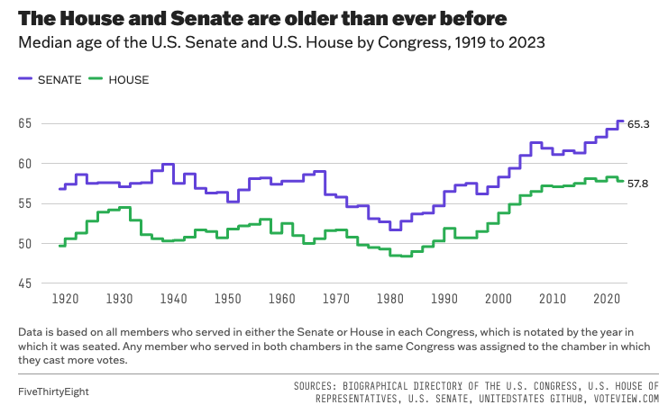
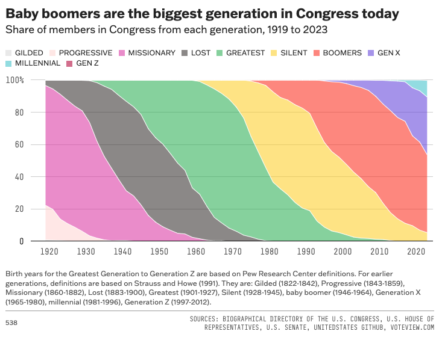

```{r setup, include=FALSE}
knitr::opts_chunk$set(echo = TRUE)
```

## Introduction

My BST270 project recreates two figures from the 538 article, [Congress Today Is Older Than It's Ever Been](https://fivethirtyeight.com/features/aging-congress-boomers/):

1. The first figure, titled "The House and Senate are older than ever before," is a step plot of the median age of Congress members by year and chamber since 1919. 

2. The second figure, titled "Baby boomers are the biggest generation in Congress today," is a stacked area plot of the proportion of Congress members by year and generation.

The original figures are presented here alongside their respective reproduction, and compared. In general, reproduction appeared to be very successful, with reproduced plots appearing almost identical to those previously reported.


## Dependencies

Here are the libraries required by this project:
```{r libraries, message=F}
library(tidyverse)
library(ggrepel)
```

Here are the scripts sourced by this project (stored in R subdirectory):
```{r scripts}
source('R/fig1.R')
source('R/fig2.R')
```

## Data: Congress demographics

### Raw
Raw data was obtained from Github, and can be accessed from [here](https://github.com/fivethirtyeight/data/tree/master/congress-demographics). A full data dictionary is also available at that location (README.md). A copy of the data is stored in CSV format within the data subdirectory.

```{r import}
raw_df <- read.csv('data/data_aging_congress.csv')
```

The first three records look like this:
```{r}
head(raw_df, 3)
```

### Processed
The following chunk processes the raw data: 

1. The figures I recreated are visualizations of time series, with year as the time unit on the x-axis. `year` is extracted from the `start_date` of each congress member's term.
2. Each congress member is classified based on their birthday into a `generation`. New variable `generation_ord` is a factor which reorders the levels of generation from youngest, or most recent, to older, or latest. This ordering is necessary to recreate Figure 2.

```{r process}
work_df <- raw_df %>%
  mutate(year = year(start_date),
         generation_ord = factor(generation,
                                 levels = c('Gen Z', 'Millennial', 'Gen X',
                                            'Boomers', 'Silent', 'Greatest', 
                                            'Lost', 'Missionary', 'Progressive',
                                            'Gilded')))
```


## Figure 1: Median age by year and chamber

### Original figure
<center>
[](https://fivethirtyeight.com/features/aging-congress-boomers/#:~:text=in%201913.-,%22%3E2,-What%E2%80%99s%20behind%20these)
</center>

### Reproduced figure
```{r plot1, fig.align='center', message=F}
fig1 <- gen_fig1(work_df)
fig1
```

### Comparison
The reproduced Figure 1 is almost identical to the original. Trends in the two lines are the same, but behaviour of the last time point appears to differ slightly. If we investigate the data, and cross-reference the original figure, it appears that the estimated median age is correct for 2023. That is, the median ages in 2023 were 57.8 and 65.3 for House and Senate members, respectively. I believe this discrepancy in the last time point is due to how I defined steps in my `ggplot2` object, e.g., I may need to modify `geom_step` to specify `direction = 'mid'`.


```{r, message=F}
work_df %>% 
  group_by(year, chamber) %>%
  summarize(median_age = median(age_years)) %>%
  arrange(-year) %>%
  head()
```

## Figure 2: Proportion of generation by year

### Original figure

<center>
[](https://fivethirtyeight.com/features/aging-congress-boomers/#:~:text=in%20the%20mid%2D-,2010s.,-Thanks%20to%20their)
</center>

### Reproduced figure

```{r plot2, fig.align='center', message=F}
fig2 <- gen_fig2(work_df)
fig2
```

### Comparison
The reproduced figure is basically identical to the original figure. There are some white gaps at the top of the figure, towards 100%, for some generations. These gaps are caused by rounding errors, since this is a stacked area plot, with the y-axis corresponding to estimated proportion.